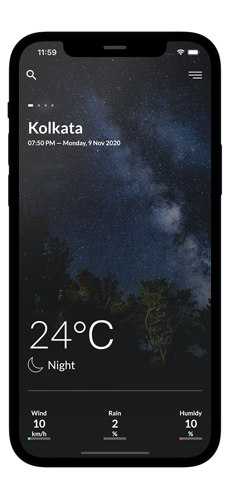
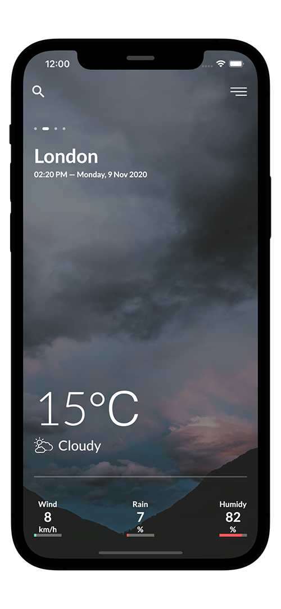
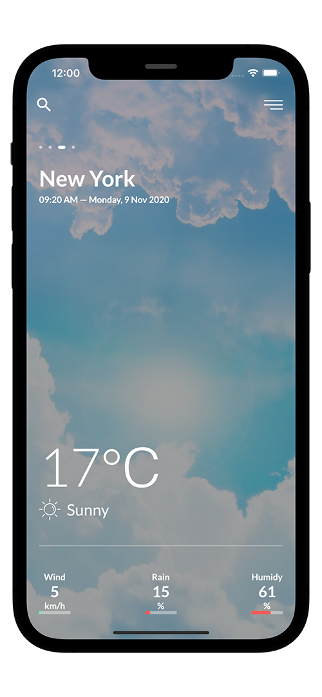
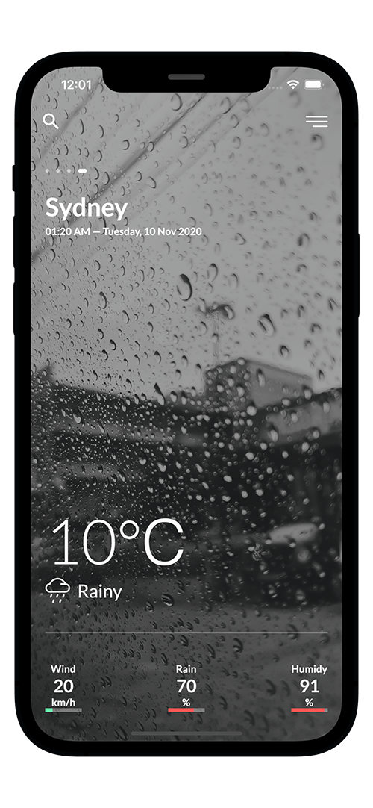

# Flutter Weather App

A Flutter project where I have created Weather App UI.

Star⭐ the repo if you like what you see😉.

## ✨ Requirements
* Any Operating System (ie. MacOS X, Linux, Windows)
* Any IDE with Flutter SDK installed (ie. IntelliJ, Android Studio, VSCode etc)
* A little knowledge of Dart and Flutter
* A brain to think 🤓🤓

## Screenshots

 
 
 
  

## Installation

#### 1. [Setup Flutter](https://flutter.dev/docs/get-started/install)

#### 2. Clone the repo

#### 3. Enjoy

## 🤓 Author(s)
**Ayoub Ghoudan